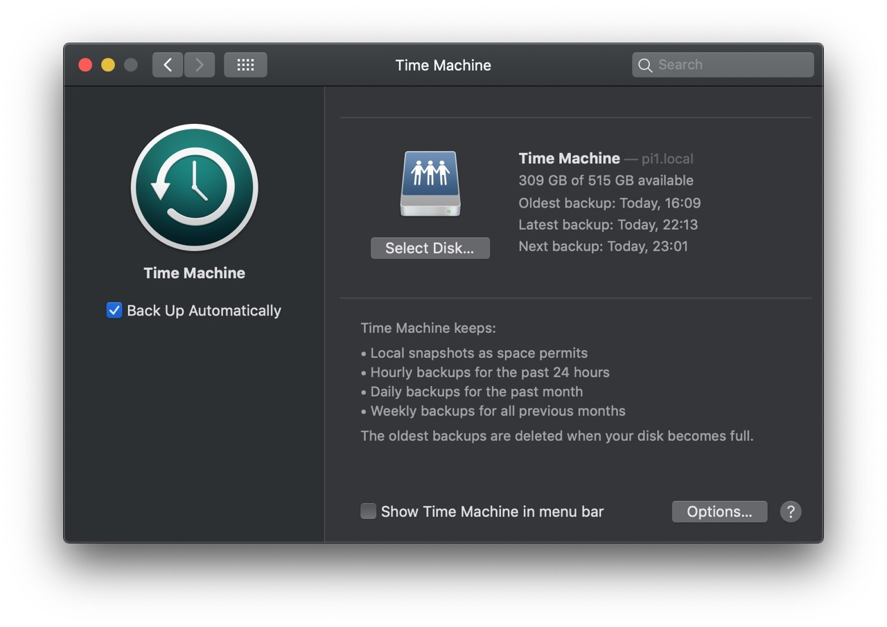

# timemachine

Running a timemachine server on a linux host for backing up your mac.



## Prerequisites

A HFS+ formatted disk (or disk image). This role includes the tools needed to format this on linux. To avoid dealing with apple encryption, I'm running this as an image on top of a LUKS encrypted drive. The Timemachine client can also encrypt the backups.

To create the image file

```shell
fallocate -l 500G /path/to/imagefile.img
mkfs.hfsplus /path/to/imagefile.img -v TimeMachine
```

To mount it:

```shell
mount -t hfsplus /path/to/timemachine.img /timemachine -o rw,force,user
```

This role doesn't add it to fstab, since for me it's an image file running on a LUKS volume, which isn't in `/etc/crypttab` for various reasons.


https://blog.jhnr.ch/2023/01/09/setup-apple-time-machine-network-drive-with-samba-on-ubuntu-22.04/
