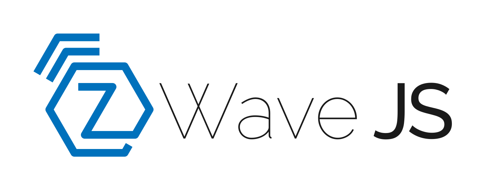

# hass-zwave

Runs [Z-Wavez JS](https://zwave-js.github.io/node-zwave-js/#/) in a docker container, accessing the
serial interface of the Z-Wave stick over [a `ser2net` TCP connection](../roles/hass-ser2net).

